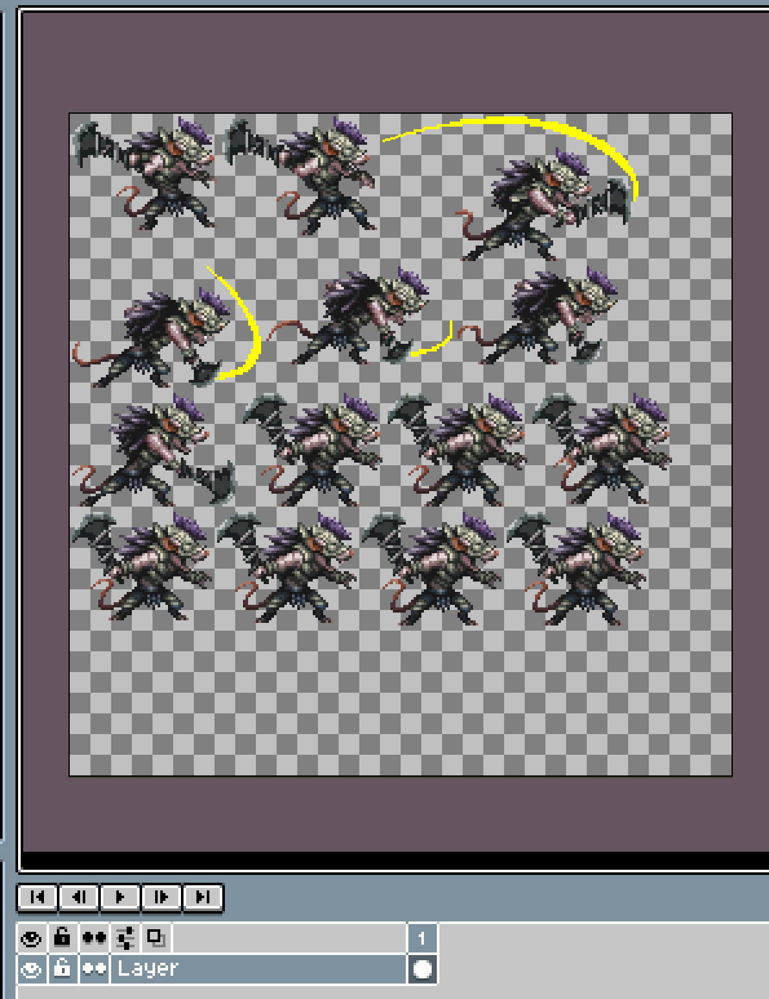
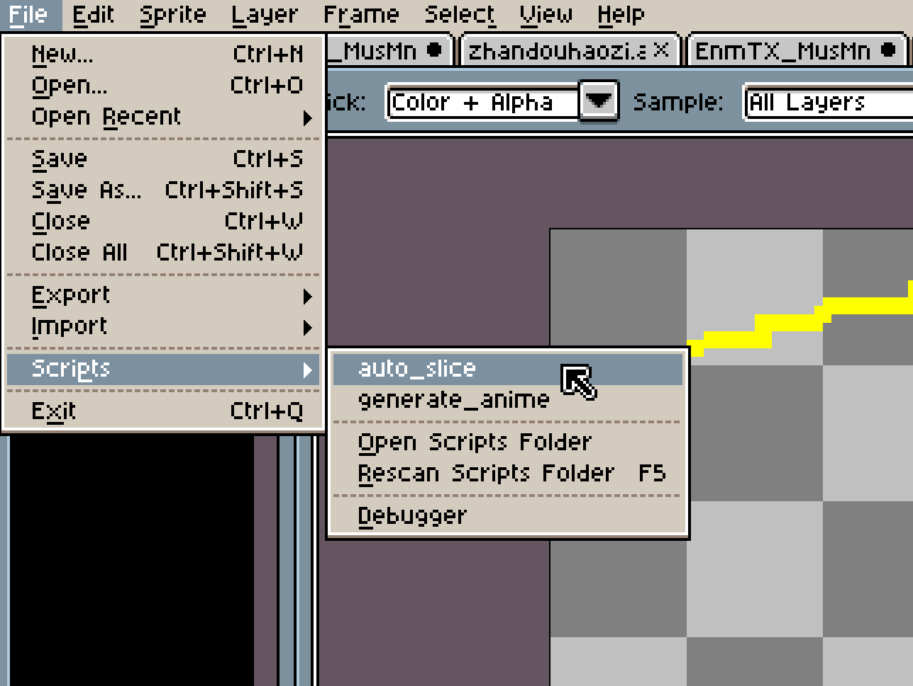
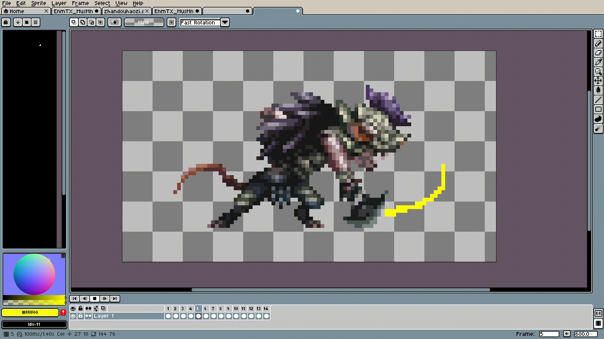

# Aseprite Auto Slice

English | [简体中文](README_zh.md).

## Functionality

Aseprite Auto Slice is a Lua script that automates the process of detecting and slicing sprites from a spritesheet. 

## Installation

1. Download the `auto_slice.lua` script.
2. Open Aseprite and go to `File > Scripts > Open Scripts Folder`.
3. Place the `auto_slice.lua` script into the opened directory.
4. Go back to Aseprite and select `File > Scripts > Rescan Scripts Folder`.
5. The script should now be available in the Scripts menu.

## Usage

1. Open Aseprite and load the spritesheet you want to process.
2. Run the `auto_slice.lua` script.
3. The script will create a new sprite with each detected block placed as a new frame.

## Example

### Original Spritesheet

### Detected Regions

### New Sprite with Centered Frames

## Contributing

Contributions are welcome! Please feel free to submit a pull request or open an issue if you have any suggestions or improvements.

## License

This project is licensed under the MIT License. See the [LICENSE](LICENSE) file for details.

## Contact

For any questions or inquiries, please contact [your-email@example.com](mailto:your-email@example.com).

