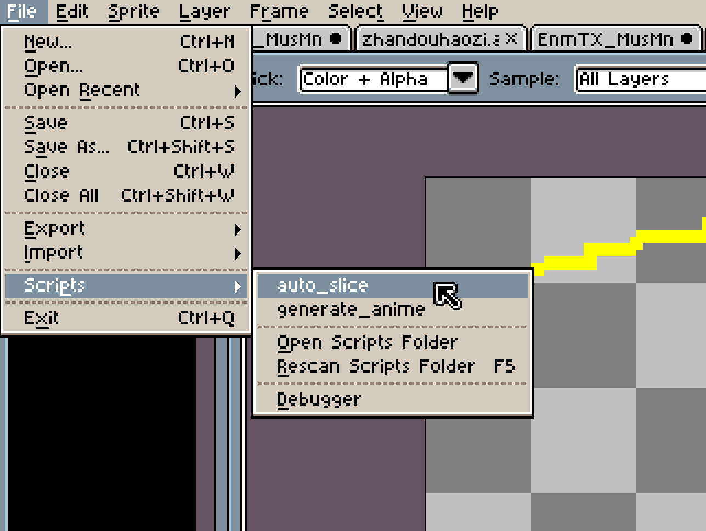
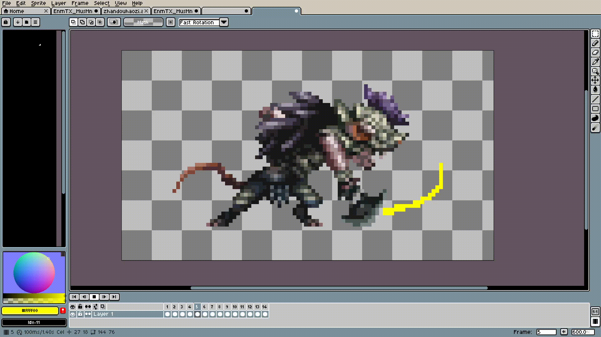

# Aseprite 自动切片

[English](README.md) | 简体中文

## 功能

Aseprite 自动切片是一个 Lua 脚本，旨在自动检测和切片 spritesheet 中的图块。

## 安装

1. 下载 `auto_slice.lua` 脚本。
2. 打开 Aseprite 并转到 `文件 > 脚本 > 打开脚本文件夹`。
3. 将 `auto_slice.lua` 脚本放入打开的目录中。
4. 返回 Aseprite 并选择 `文件 > 脚本 > 重新扫描脚本文件夹`。
5. 现在脚本应该在脚本菜单中可用。

## 使用方法

1. 打开 Aseprite 并加载要处理的 spritesheet。
2. 运行 `auto_slice.lua` 脚本。
3. 脚本将创建一个新的 Sprite，每个检测到的块作为新帧放置。

## 示例

### 原始 Spritesheet

### 检测到的区域

### 新的 Sprite，居中帧

## 贡献

欢迎贡献！如果您有任何建议或改进，请随时提交拉取请求或打开问题。

## 许可证

此项目根据 MIT 许可证授权。有关详细信息，请参阅 [LICENSE](LICENSE) 文件。

## 联系

如有任何问题或查询，请联系 [your-email@example.com](mailto:your-email@example.com)。